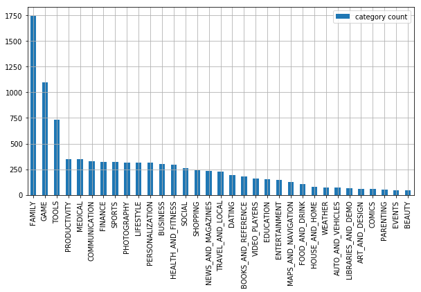

# Google Playstore App Data Analytics

This project is on the Analysis of the Google Play Store App Dataset. PlayStore apps data has enormous potential to drive app-making business to success. Actionable insights can be drawn for developers to work on capturing the Android market. The dataset is chosen from Kaggle. It is the webscrapped data of 10k PlayStore apps for analysing the Android market. It consists of 10841 lines and 13 columns in CSV format. In this repository, I would like to showcase descriptive analytics, where data is mined to extract groupings and patterns. Data Cleaning and Data Visualization is explored in this project.

The following questions can help the businesses come up with some actionable insights
 
* Which category has the most apps?
* What is the range of app rating for each category of apps?
* Which category of apps has the highest rating?
* What is the average app rating for each category of apps?
* Which category of apps has the highest rating?

The visualizations help the businesses target a particular market. A business can choose to enter a market with fewer or more competitors.

Ratings of the app is the most important factor that determines how better the app performs campared to other apps in the market. It also implies how the company responds to feedback, such as additional features that the users need, or improve its app according to feedback. 

Thanks for reading!

